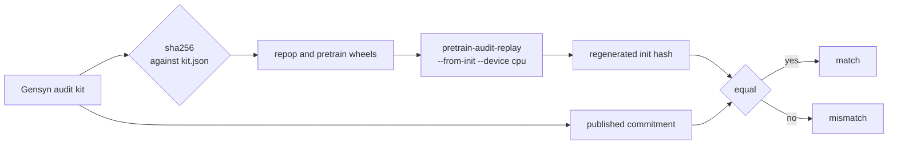
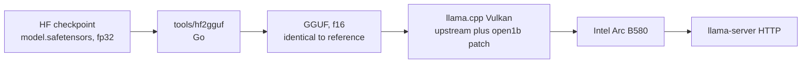

# open-1b: an independent check, and a local run

We looked at Gensyn's open-1b and its claim of auditable training, then ran the
model on our own hardware. The audit uses Gensyn's official harness. Everything
we wrote is Go.

Links: [announcement](https://www.gensyn.ai/news/introducing-open-1b-auditable-training),
[harness](https://github.com/gensyn-ai/open-transformers),
[audit app](https://open1b.gensyn.ai/).

## Results

| Check | Result |
| --- | --- |
| Init-unit audit, x86-64 CPU, no NVIDIA | Match. The published state hash `16554a11...` is reproduced exactly. |
| Training-interval audit | Not run. No interval unit is published, and a replay needs about 24 GB RAM and 60 GB disk. |
| GGUF conversion (Go) | Byte-identical to the reference conversion, same SHA-256. |
| Local inference, one Intel Arc B580 | 114 tok/s decode, 892 tok/s prefill, about 3.6 GiB VRAM. |

Reports: [audit](docs/audit-open1b-init.md), [local run](docs/open1b-local-inference.md),
[benchmarks](docs/benchmarks.md), [inference stack](docs/inference-stack.md).

## How it works

Audit. Replay one published commitment and compare hashes.



Inference. Convert in Go, serve on one Arc. The engine is a patched llama.cpp.



## Repository layout

```
docs/
  audit-open1b-init.md
  open1b-local-inference.md
  benchmarks.md
  inference-stack.md
  llama-cpp-open1b.patch
tools/hf2gguf/
```

## The audit, and its limits

The init unit regenerates the published initial state hash exactly on a plain
CPU. The installed wheels match the kit manifest, and the repop build commit
matches the manifest.

It does not cover a training step. An init-only unit says nothing about the
forward pass, the backward pass, the optimizer, or the data stream, so the
per-step claim stays untested here. Three more reasons to be careful:

- repop ships as compiled wheels only, under a custom licence. The kernels that
  make training reproducible cannot be read or checked.
- The v3 state hash omits the RNG, the data-stream cursor, spike state, and the
  meta.json descriptor keys.
- No interval unit is published, so "replay any step" is not yet something an
  outsider can do without permission.

A match shows that the pinned artifacts reproduce the published commitment on
our machine. It does not show how the original run was carried out.

## Conversion in Go

`tools/hf2gguf` reads the Hugging Face checkpoint (config.json,
model.safetensors, tokenizer.json) and writes a GGUF file, using
[go-gguf](https://github.com/cymertek/go-gguf). A reference GGUF from llama.cpp's
converter, built with our open1b patch, is read only, as the schema to match.

```bash
cd tools/hf2gguf
go build -o hf2gguf .
./hf2gguf convert -ref models/open-1b-sft-f16.gguf \
    -safetensors models/open-1b-sft/model.safetensors \
    -config models/open-1b-sft/config.json \
    -tokenizer-config models/open-1b-sft/tokenizer_config.json \
    -tokenizer models/open-1b-sft/tokenizer.json \
    -o models/open-1b-sft-f16-go.gguf
./hf2gguf verify -ref models/open-1b-sft-f16.gguf -got models/open-1b-sft-f16-go.gguf
```

`verify` reports 39 of 39 metadata keys and 220 of 220 tensors identical. The two
files share SHA-256
`a18530417c732bb115a3501a7e1388ea7a54bd2a96c70be571d1249aa210fbae`.

## Running the model

Upstream llama.cpp has no open1b architecture, so the model needs a patched
build. Details in the [inference stack](docs/inference-stack.md).

```bash
llama-server -m models/open-1b-sft-f16-go.gguf \
  --device Vulkan2 -ngl 99 -c 32768 -fa off --jinja \
  --spec-type ngram-map-k,ngram-cache \
  -t 16 --parallel 1 --alias open-1b --host 127.0.0.1 --port 8085
```

`-fa off` is required on these Arc/Vulkan builds, which keeps the KV cache in
f16. The requested 32k context is capped to the model's 4096.

## Caveats

- Chat template. With the vendor tail `...assistant<|end_header|>` followed by a
  blank line, the released SFT checkpoint emits an end-of-turn token first and
  returns an empty reply. Our GGUF is identical to the reference, so this is a
  property of the released weights. Seed the assistant turn, set ignore_eos, or
  adjust the trailing newline.
- Model quality. open-1b scores 25.4 on the OLMo2 suite, against 31.9 for
  OLMo2-1B. It is a test of verifiability, not a strong model.
- Scope. We run and inspect released weights and replay one published
  commitment. We do not train or fine-tune anything.

## License

MIT, see [LICENSE](LICENSE). The harness is Apache-2.0. repop, the checkpoints,
and the corpus are distributed by Gensyn under their own terms.

Built on Gensyn's release. Not affiliated with Gensyn.
