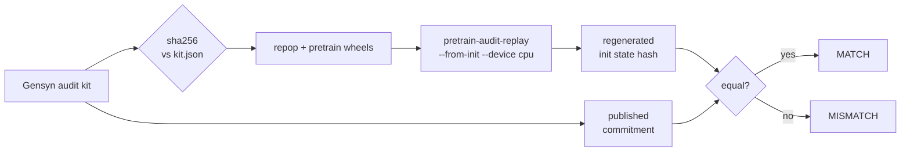
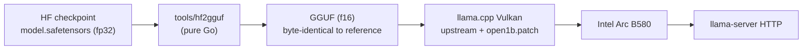

# open-1b — independent verification & local inference

An independent, reproducible check of Gensyn's **open-1b** "auditable training"
claim — plus a **pure-Go** path to convert and run the model locally.

> Reference: [Introducing open-1b](https://www.gensyn.ai/news/introducing-open-1b-auditable-training)
> · harness: [gensyn-ai/open-transformers](https://github.com/gensyn-ai/open-transformers)
> · audit app: [open1b.gensyn.ai](https://open1b.gensyn.ai/)

Everything we wrote is **Go** (no Python in our code or pipeline). For the audit we
used Gensyn's official harness, which is Python-only and the sole vendor-supplied
path; for inference we wrote our own Go GGUF converter.

## Results

| Item | Result |
|------|--------|
| **Init-unit audit** (Linux x86-64 CPU, no NVIDIA) | ✅ **MATCH** — published `state_hash 16554a11…` reproduced bit-for-bit |
| **Training-interval audit** | ⛔ blocked — no interval unit is published; replay needs ~24 GB RAM / ≥60 GB disk |
| **GGUF conversion** (Go, `tools/hf2gguf`) | ✅ **byte-identical** to the vendor GGUF (same SHA-256) |
| **Local inference** (1× Intel Arc B580, Vulkan) | ✅ ~114 tok/s decode · ~892 tok/s prefill · ~3.6 GiB VRAM |

Details: [`docs/audit-open1b-init.md`](docs/audit-open1b-init.md),
[`docs/open1b-local-inference.md`](docs/open1b-local-inference.md),
[`docs/benchmarks.md`](docs/benchmarks.md),
[`docs/inference-stack.md`](docs/inference-stack.md).

## How it works

**Audit — replay one published commitment and compare.**



**Inference — convert in Go, serve on one Arc (the engine is a patched llama.cpp).**



## Repository layout

```
docs/
  audit-open1b-init.md      # init-unit audit report (raw evidence)
  open1b-local-inference.md # local bring-up report
  benchmarks.md             # speed benchmarks + reference comparison
  inference-stack.md        # how llama.cpp was built/launched (NOT stock)
  llama-cpp-open1b.patch    # local Open1B patch applied to llama.cpp
tools/hf2gguf/              # pure-Go safetensors → GGUF converter (dump/convert/verify)
```

## Audit — what it proves, and what it does not

**Proves.** The installed artifacts are the ones the kit's `kit.json` published
(all SHA-256s match); the `repop` build commit matches the manifest; and running
the vendor harness on a plain CPU regenerates the `1b_repop_v2` initial state hash
**bit-for-bit** — an independent third party reproduced the run's init commitment.

**Does not prove.**

- **No training interval.** An init-only unit says nothing about any forward/backward/AdamW/data-stream step. The claim about bitwise-reproducible *optimizer steps* is not exercised here.
- **`repop` is closed source.** Only compiled wheels ship, under the "Gensyn Reproducibility License v1.0". The kernels that make training reproducible cannot be read or independently re-derived.
- **The v3 hash omits** RNG, the data-stream cursor, spike state, and `meta.json` descriptor keys.
- **No interval unit is published**, so "pick any step, replay it" is not self-serve checkable yet.
- Provenance of the *published run* is not established — only that the pinned artifacts reproduce the published commitment on our machine.

## GGUF conversion (pure Go)

`tools/hf2gguf` reads the HF checkpoint (`config.json`, `model.safetensors`,
`tokenizer.json`) and writes a GGUF file, using
[`github.com/cymertek/go-gguf`](https://github.com/cymertek/go-gguf) for GGUF
read/write. A reference GGUF produced by llama.cpp's `convert_hf_to_gguf.py`
**with our [Open1B patch](docs/llama-cpp-open1b.patch)** is used **read-only as
the schema oracle**, so the output is validated byte-for-byte.

```bash
cd tools/hf2gguf
go build -o hf2gguf .

./hf2gguf dump   -gguf models/open-1b-sft-f16.gguf -o manifest.json
./hf2gguf convert -ref models/open-1b-sft-f16.gguf \
    -safetensors models/open-1b-sft/model.safetensors \
    -config models/open-1b-sft/config.json \
    -tokenizer-config models/open-1b-sft/tokenizer_config.json \
    -tokenizer models/open-1b-sft/tokenizer.json \
    -o models/open-1b-sft-f16-go.gguf
./hf2gguf verify -ref models/open-1b-sft-f16.gguf -got models/open-1b-sft-f16-go.gguf
```

`verify` reports `39/39 metadata keys` and `220/220 tensors` byte-identical; the
two files share SHA-256 `a18530417c732bb115a3501a7e1388ea7a54bd2a96c70be571d1249aa210fbae`.

## Running the model locally

> **Engine caveat:** open-1b needs an `open1b` architecture that upstream llama.cpp
> does not have. We run a build with a local patch — see
> [`docs/inference-stack.md`](docs/inference-stack.md).

Serve the (or our Go-built) GGUF on one Arc B580 with llama.cpp's Vulkan backend:

```bash
llama-server \
  -m models/open-1b-sft-f16-go.gguf \
  --device Vulkan2 -ngl 99 -c 32768 -fa off --jinja \
  --spec-type ngram-map-k,ngram-cache \
  -t 16 --parallel 1 --alias open-1b --host 127.0.0.1 --port 8085
```

Notes: `-fa off` is required on these Arc/Vulkan builds (so KV stays f16); the
requested `-c 32768` is capped to the model's **4096**-token context.

## Caveats

- **Chat-template quirk.** With the exact vendor tail `…assistant<|end_header|>\n\n`,
  the released SFT checkpoint emits `<|eot|>` as its first token (empty reply).
  Our GGUF is byte-identical to the vendor one, so this is a property of the
  released checkpoint, not of the conversion. Workarounds: seed the assistant
  turn, use `ignore_eos`, or fix the trailing newline.
- **Not a strong model.** open-1b scores 25.4 on the OLMo2 suite (vs 31.9 for
  OLMo2-1B). Its value is **verifiability**, not quality — see
  [`docs/benchmarks.md`](docs/benchmarks.md).
- **Scope.** We only run/inspect the released weights and replay one published
  commitment; we do not train or fine-tune anything.

## License

MIT — see [`LICENSE`](LICENSE). The vendor harness (`open-transformers`) is
Apache-2.0; `repop`, the checkpoints and the corpus are distributed separately by
Gensyn under their own terms.

## Credits

Built on Gensyn's open-1b release and audit tooling. Independent work; not
affiliated with Gensyn.
