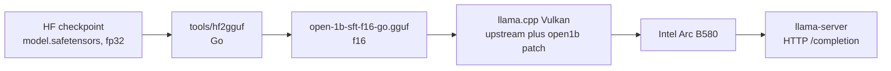

# Inference stack: how llama.cpp was built and launched

This records the engine behind the local run. Is the llama.cpp build stock? No.

## Provenance

| | |
| --- | --- |
| Upstream base | `ggerganov/llama.cpp` at `c32d1dabe`, 2026-09-10 |
| Local changes | uncommitted patches adding the `open1b` architecture, 9 files, +299 lines |
| Patch | [llama-cpp-open1b.patch](llama-cpp-open1b.patch) |
| Build | `-DGGML_VULKAN=ON -DGGML_NATIVE=ON -DCMAKE_BUILD_TYPE=Release` |
| Binary | `build-vulkan/bin/llama-server`, `0.4.0-dev`, build 10893 |

Upstream has no `open1b` architecture, so the patch is required. open-1b is
Llama-3-derived, with four differences the loader and graph must know about:

- gain-free per-head RMSNorm on Q and K before RoPE,
- RMSNorm on the token-embedding output,
- hybrid sliding-window attention, 512 tokens, full causal on the last layer of
  each group of five and on the final layer,
- untied embedding and LM head, with interleaved-pair RoPE.

## Patch inventory

| File | Change |
| --- | --- |
| `src/models/open1b.cpp` | new: `llama_model_open1b`, hparams, tensors, graph |
| `src/models/models.h` | declare the model |
| `src/llama-arch.h`, `.cpp` | add `LLM_ARCH_OPEN1B` |
| `src/llama-model.cpp` | dispatch the arch, set the RoPE type |
| `gguf-py/gguf/constants.py` | arch enum, name, tensor list |
| `gguf-py/gguf/tensor_mapping.py` | HF to GGUF tensor names |
| `conversion/__init__.py` | register the converter |
| `conversion/open1b.py` | new: `Open1BModel` converter |

## Build

```bash
git clone https://github.com/ggerganov/llama.cpp
cd llama.cpp
git checkout c32d1dabe
git apply /path/to/llama-cpp-open1b.patch

cmake -B build-vulkan -DGGML_VULKAN=ON -DGGML_NATIVE=ON -DCMAKE_BUILD_TYPE=Release
cmake --build build-vulkan --config Release -j
```

## Launch

```bash
setsid --fork ./build-vulkan/bin/llama-server \
  -m models/open-1b-sft-f16-go.gguf \
  --device Vulkan2 -ngl 99 -c 32768 -fa off --jinja \
  --spec-type ngram-map-k,ngram-cache \
  -t 16 --parallel 1 --alias open-1b \
  --host 127.0.0.1 --port 8085 >/tmp/open1b.log 2>&1 </dev/null &
```

| Flag | Reason |
| --- | --- |
| `--device Vulkan2` | one Intel Arc B580. Vulkan1 to 3 are the three Arc cards; Vulkan0 is the AMD iGPU. |
| `-ngl 99` | offload all layers |
| `-fa off` | Flash-Attention crashes on these Arc/Vulkan builds, so the KV cache stays in f16 |
| `-c 32768` | requested, capped to the model's 4096-token context |
| `--spec-type ngram-map-k,ngram-cache` | about 2.4x decode on small dense models |
| `--jinja` | use the model's chat template |

## Pipeline



## Notes

- The patch is ours and uncommitted. The exported patch file makes the build
  reproducible. Committing it, or proposing it upstream, would be better.
- The reference GGUF is not an independent artifact. It came from llama.cpp's
  `convert_hf_to_gguf.py` with this same patch. The Go converter reproduces it
  byte for byte, which is a real reimplementation of the GGUF writer, but the
  comparison is against our own patched Python output, not a file published by
  Gensyn.
- The patch was written for bring-up. It is not upstream-reviewed.
