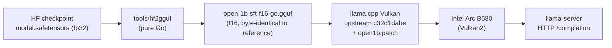

# Inference stack — how llama.cpp was built and launched

This documents the exact engine used to run **open-1b** locally, and answers the
fair question: *is the llama.cpp build stock?* **No.**

## Engine provenance — not stock

| | |
|---|---|
| **Upstream base** | `ggerganov/llama.cpp` @ `c32d1dabe` — "tests : increase tolerance for Add fusion tests (#28691)", 2026-09-10 |
| **Local changes** | uncommitted patches adding the **`open1b`** architecture (9 files, +299 lines) |
| **Exported patch** | [`llama-cpp-open1b.patch`](llama-cpp-open1b.patch) |
| **Build** | `-DGGML_VULKAN=ON -DGGML_NATIVE=ON -DCMAKE_BUILD_TYPE=Release` |
| **Binary** | `build-vulkan/bin/llama-server` — `0.4.0-dev (build 10893, commit c32d1dabe)` |

**Why the patch is required.** Upstream llama.cpp has no `open1b` architecture. open-1b
is Llama-3-derived but differs in four ways that the loader/graph must know about:

- gain-free per-head RMSNorm on Q and K before RoPE (`qk_norm`, no learnable gain);
- RMSNorm on the **token-embedding output** (`embedding_norm`);
- **hybrid sliding-window attention** (512-token window, full causal on the last layer of each group of 5 and on the final layer);
- **untied** input embedding / LM head, and interleaved-pair RoPE (`LLAMA_ROPE_TYPE_NORM`).

## Patch inventory

| File | Change |
|---|---|
| `src/models/open1b.cpp` | **new** — `llama_model_open1b`: hparams, tensor mapping, graph |
| `src/models/models.h` | declare `llama_model_open1b` |
| `src/llama-arch.h` / `.cpp` | add `LLM_ARCH_OPEN1B` (enum + name) |
| `src/llama-model.cpp` | dispatch `LLM_ARCH_OPEN1B`; RoPE type `NORM` |
| `gguf-py/gguf/constants.py` | `MODEL_ARCH.OPEN1B`, arch name, tensor list |
| `gguf-py/gguf/tensor_mapping.py` | HF → GGUF tensor name map |
| `conversion/__init__.py` | register the converter |
| `conversion/open1b.py` | **new** — `Open1BModel` HF→GGUF converter |

## Build

```bash
git clone https://github.com/ggerganov/llama.cpp
cd llama.cpp
git checkout c32d1dabe
git apply /path/to/llama-cpp-open1b.patch

cmake -B build-vulkan -DGGML_VULKAN=ON -DGGML_NATIVE=ON -DCMAKE_BUILD_TYPE=Release
cmake --build build-vulkan --config Release -j
```

## Launch

```bash
setsid --fork ./build-vulkan/bin/llama-server \
  -m models/open-1b-sft-f16-go.gguf \
  --device Vulkan2 -ngl 99 -c 32768 -fa off --jinja \
  --spec-type ngram-map-k,ngram-cache \
  -t 16 --parallel 1 --alias open-1b \
  --host 127.0.0.1 --port 8085 >/tmp/open1b.log 2>&1 </dev/null &
```

| Flag | Why |
|---|---|
| `--device Vulkan2` | a single Intel Arc B580 (Vulkan1/2/3 = the three Arc; Vulkan0 = AMD iGPU) |
| `-ngl 99` | offload all layers |
| `-fa off` | Flash-Attention crashes on these Arc/Vulkan builds; KV thus stays f16 |
| `-c 32768` | requested, but capped to the model's **4096**-token context |
| `--spec-type ngram-map-k,ngram-cache` | ~×2.4 decode on small dense models |
| `--jinja` | use the model's chat template |

## Pipeline



## Caveats

- **The patch is ours and uncommitted.** It lives only in the working tree of the
  build source; `llama-cpp-open1b.patch` is its export. For reproducibility it should
  be committed and, ideally, proposed upstream.
- **The "reference" GGUF is not an independent vendor artifact.** It was produced by
  llama.cpp's `convert_hf_to_gguf.py` **with this same Open1B patch**. Our Go converter
  reproduces it byte-for-byte — a genuine independent reimplementation of the GGUF
  serialization — but "byte-identical to the reference" means *identical to our patched
  Python path*, not to a Gensyn-published file.
- Patch quality: written for bring-up and validated by a working inference run; not
  reviewed upstream.
